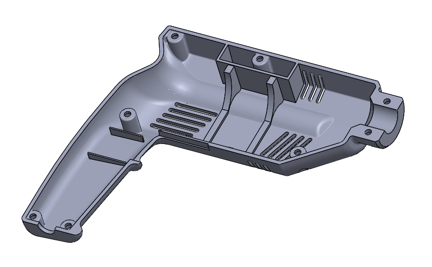

# Plastic part of drill
This sample shows possibilities of basic modeling and creating a drawing in SolidWorks. For concretely description this model is A hand-held corded electric drill.

	
	 
	 
	

		<a href="https://www.patreon.com/sindresorhus">My open source work is supported by the community</a>
	

	 
	 

